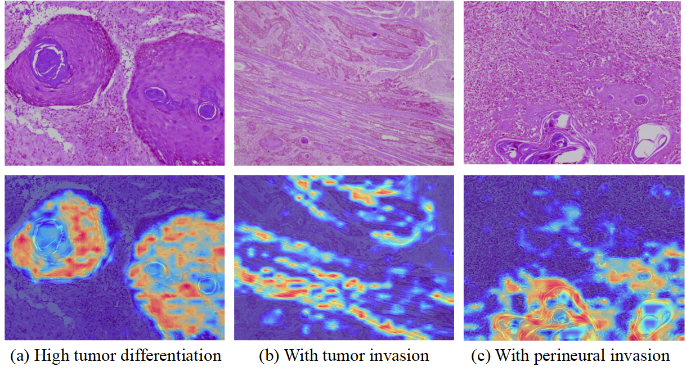
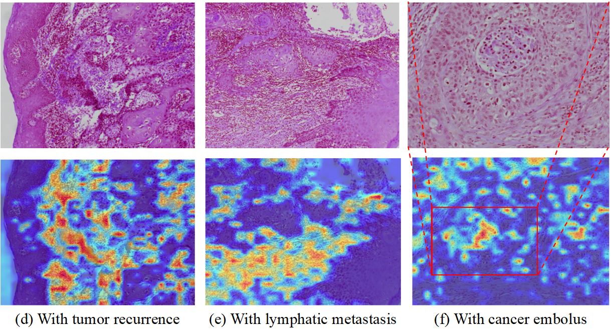

# OSCC-PathologyImageDataset

## (1) Multi-OSCC Datasets 

### 1-1 Dataset Download

- Down load the data from zenodo: https://zenodo.org/records/16842637
- Down load the data from Baidu NetDisk (with password oscc): https://pan.baidu.com/s/1wQA9peK_yWpAC2sALep8nQ?pwd=oscc 

### 1-2 Dataset splitation
Following the random seed 42, we split the dataset into training, validation, and test sets with a ratio of 70:15:15.
In `json` file: `./Data/split_seed=2024.json`

### 1-3 Images labels
We save the images labels in `json` file: `./Data/all_metadata.json`


## (2) Baseline weights

### 2-1 Best setting of each task
The best setting of each tasks are shown in the following table, and these models are trained in the single-task mode.

| Task | AUC(%)   | Setting                                      |
|------|----------|---------------------------------------------|
| REC  | 94.72%   | ViT-Base (Hibou-B)                          |
| LNM  | 71.06%   | ViT-Small (PathoBench with Reinhard stain normalization) |
| TD   | 81.23%   | ViT-Base (CONCH)                            |
| TI   | 72.6%    | ViT-Base (PathoBench with Macenko stain normalization) |
| CE   | 75.52%   | Swin-Base (Imagenet)                        |
| PI   | 74.17%   | ViT-Base (CONCH)                            |

### 2-2 Final benchmark results after unified model settings
The benchmark results of the unified model settings are shown in the following table.

|   Benchmark  | REC   | LNM   | TD    | TI    | CE    | PI    |
|---------|-------|-------|-------|-------|-------|-------|
| Single-Task  AUC(%)  |93.13% |71.06% |75.21% |72.47% |75.52% |66.19%|
| Multi-Task  AUC(%)  |87.17% |67.61% |72.51% |67.82% |68.37% |67.41%|

## (3) Environment
Follow the instructions below to create a conda environment with the required dependencies.
```
conda env create -f environment.yml
conda activate Multi-OSCCPI
pip install torch==1.13.0+cu116 torchvision==0.14.0+cu116 -f https://download.pytorch.org/whl/torch_stable.html
pip install -r requirements.txt 
```


## (4) Visualization

<!-- 使用方法1：HTML 标签 -->
<p align="center">
  
</p>

<p align="center">
  
</p>

## Cite this work
If you use this dataset, please cite the following paper:
```
@misc{guan2025high,
    title={A High Magnifications Histopathology Image Dataset for Oral Squamous Cell Carcinoma Diagnosis and Prognosis},
    author={Jinquan Guan and Junhong Guo and Qi Chen and Jian Chen and Yongkang Cai and Yilin He and Zhiquan Huang and Yan Wang and Yutong Xie},
    year={2025},
    eprint={2507.16360},
    archivePrefix={arXiv},
    primaryClass={eess.IV}
}
```
